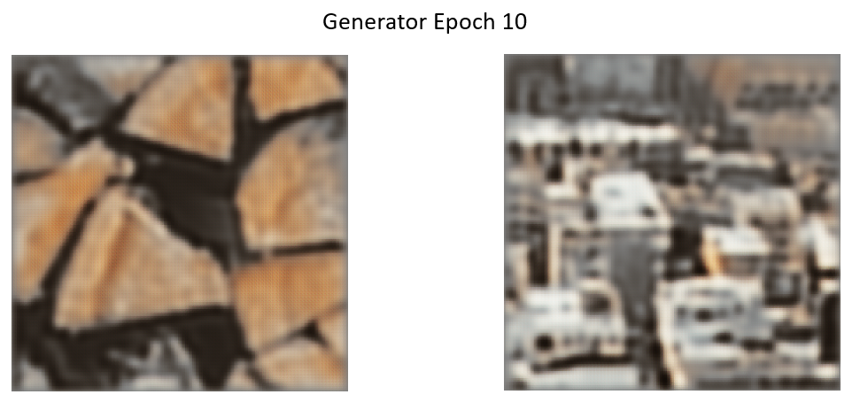
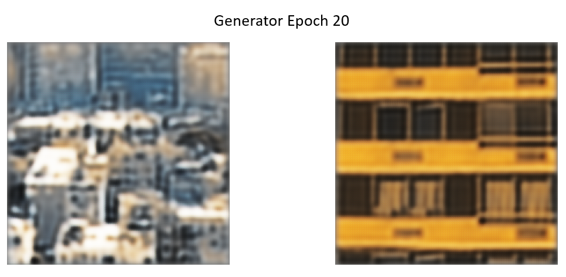
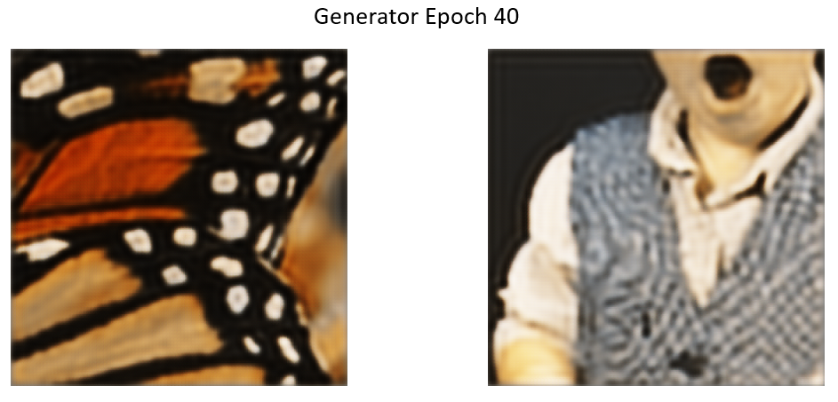
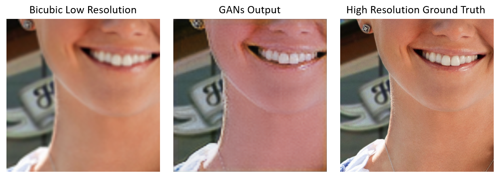
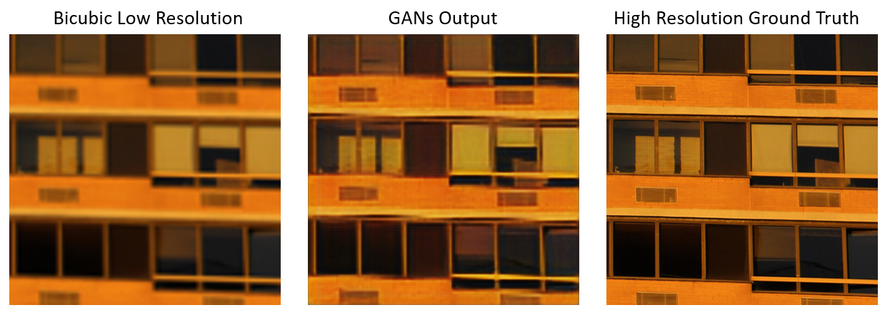
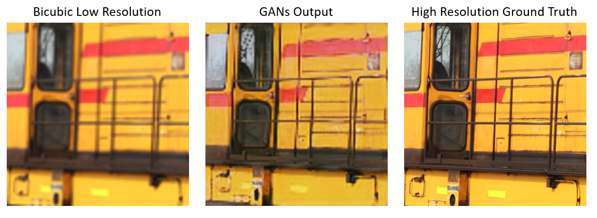
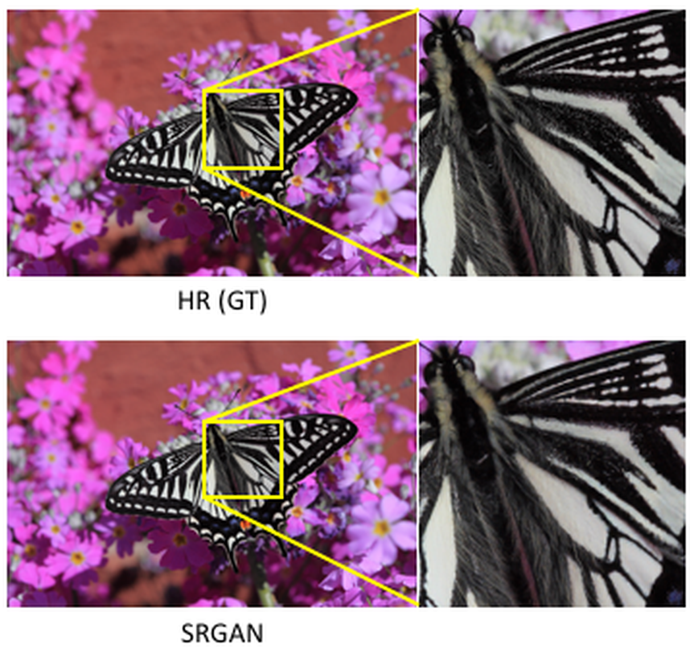

# GAN You Feel the Love Tonight

This repository contains materials related to the semester-long project for CMPE 255 (Data Mining).

## Team

* Brian Ho ([hobriandh](https://github.com/hobriandh))
* Chinmay Kamerkar ([mercury297](https://github.com/mercury297))
* Pratik Kasle ([PRKKILLER](https://github.com/PRKKILLER))
* Andrew Selvia ([AndrewSelviaSJSU](https://github.com/AndrewSelviaSJSU))

## Presentation

We presented the core principles of GANs to the class on March 9th. You can review our presentation at Andrew's GitHub. Since we were the first to present, we had no time to implement any of our ideas, thus this report presents details about our implementation strategies.

## Abstract

Our research focuses on *Generative Adversarial Networks* (GANs). We chose to divide the work so we could explore two unique applications of GANs. This way, we could compare and contrast the efficacy of different architectures and approaches. Andrew and Brian chose to focus on training a GAN to generate pictures from text; in other words, text-to-image. Chinmay and Pratik chose to focus on...

## Super Resolution (SR) GANs

### Approach

Super resolution GANs aims to increase the resolution of images.  SR GANs applies a deep neural network in combination with an adversary network to produce these images.  During the training, a high-resolution image is sampled along with a low-resolution counterpart.  The deep neural network acts as a generator which takes in the low-resolution image and outputs its own high-resolution image.  This generated image is then put into the discriminator network to determine whether the generated image is close enough to the ground truth or if it is just a generated image.


This machine learning project was run locally on a NVIDIA GeForce RTX 2060 graphics card.  In order to run on a local machine using a graphics card, there are some necessary drivers to install for tensorflow.  First, the [NVIDIA GPU Drivers](https://www.nvidia.com/download/index.aspx?lang=en-us) are needed.  Then the [NVIDIA CUDA Toolkit](https://developer.nvidia.com/cuda-toolkit-archive) is needed.  This project was run on CUDA v10.0 to work with the Tensorflow v2.0.0b1.  Lastly, the [NVIDIA cuDNN](https://developer.nvidia.com/rdp/cudnn-archive) version that matches the machine's CUDA version is needed.  Once all of these packages are installed, the user can run the program.

The dataset was pulled from the [DIV2K - bicubic downscaling x4 competition](https://data.vision.ee.ethz.ch/cvl/ntire17//).

To start training, the user needs to run the train script:
```bash
python train.py
```

The dataset was trimmed down to lessen the total runtime.  There were 48 total training images and 24 total validation images.
The initial generator was run for 50 epochs with 6 steps and each step took around 14.5 seconds.
In the second pass that included the discriminator, the model was run for 100 epochs with 12 steps and each step took around 65 seconds.

### Results

After training on the [DIV2K - bicubic downscaling x4 competition](https://data.vision.ee.ethz.ch/cvl/ntire17//) images, we were able to produce some higher-resultion image results.

First, we can view the generator as it initially trains without the discriminator network.  





We can see that the first ten epochs generated an incredibly blurry and almost unrecognizable images.  As more epochs run, the images start to become more recognizable, but the output is still low-resolution and is very blurry.  Here the model is just training on its own without any input from the discriminator yet.  We can see the generator can get the general gist of the image, but it cannot increase the quality of the image.  Some of the images also show some artifacting and the colors are warped.  We can see the warped colors mostly in the earlier epochs.  Instead of sharpening the image, it seems to blur the image by blending the colors to become duller.

Next, we train the generator along side with the discriminator.





Here, we can see the generated image in comparison with the ground truth high-resolution images.

Interestingly, we can see that the model is still changing the colors of the image.  This is most prevalent in the image with the woman's smile.  The model changed the woman's skin tone to become more bright and pink in an attempt to sharpen the image.  In the same image, the outlines seem more pixelated, however the details in the image are more accentuated.  The light reflecting off the womans lips and mouth are more pronounced than in the low-resolution image.  We can also see the model trying to make out the pattern in the woman's earrings.

The model can handle straight lines very easily.  We can see in the image of the building that the GANs output is much closer to the ground truth high-resolution image.  The coloring is only slightly off in this output as well.  We can also note that in the bottom right of the image the GANs output has also made a good attempt at finding the reflection in the glass.  Also, the model makes a good attempt at making out what looks like vents on the side of the building.

The last image shows how the model can fail at some minute details.  We can see that the output can create a good part of the overall colors and larger part of the train's shape.  However, if we look at the trees in the window of the car, there is a loss of detail.  The branches of the tree were interpreted from the low-resolution image as separate balls.  Although the model incorrectly interpreted what the low-resolution image was showing, the output shows a high-quality interpretation where the broken up branches are accentuated.

### Conclusion

Our results showed the key parts of how the model works.  The SR GANs model would work incredibly well when there are little details and less complex shapes in the low-resolution input image.  However, the model tries to accentuate small details with its best guess when those details are introduced.  Another area where this model succeeds is its ability to sharpen not just grayscale images, but also colored images.

These examples show what the model can output given more steps and epochs.  This model ran 100 epochs with 100 steps for the initial generator and 2000 epochs with 50 steps with the discriminator model included.  This is also not using the truncated dataset, but instead 800 images for training and 100 images for validation.




In the future, we plan on running the full dataset with the necessary amounts of epochs and steps.  However, since the time for training goes up exponentially with those increased metrics, it just was not feasable for running on our local machine even when it was running on an NVDIA GPU.  From this project the key points we learned was how a GANs model worked and how to incorperate an NVIDA graphics card into our training to expedite the training time.

### References

* [Google: Introduction to GANs](https://developers.google.com/machine-learning/gan)
* [TensorLayer approach to creating SR GANs](https://github.com/tensorlayer/srgan)
